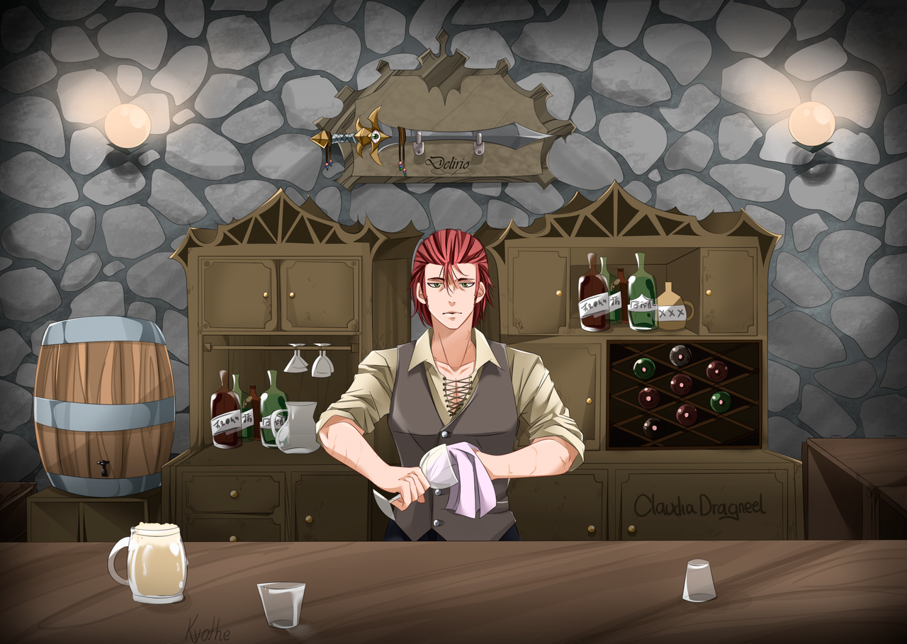

Lo que deberás incluir como requisitos mínimos será:

Una sección o página sobre información principal del restaurante

Una sección de formulario de contacto
Una sección de datos de ubicación y correo electrónico
Como características opcionales:

Un componente que permita reservar una mesa en una hora y fecha específica para un usuario
Un componente que incluya el menú completo del restaurante
Adaptado a móviles
Un blog que incluya un artículo